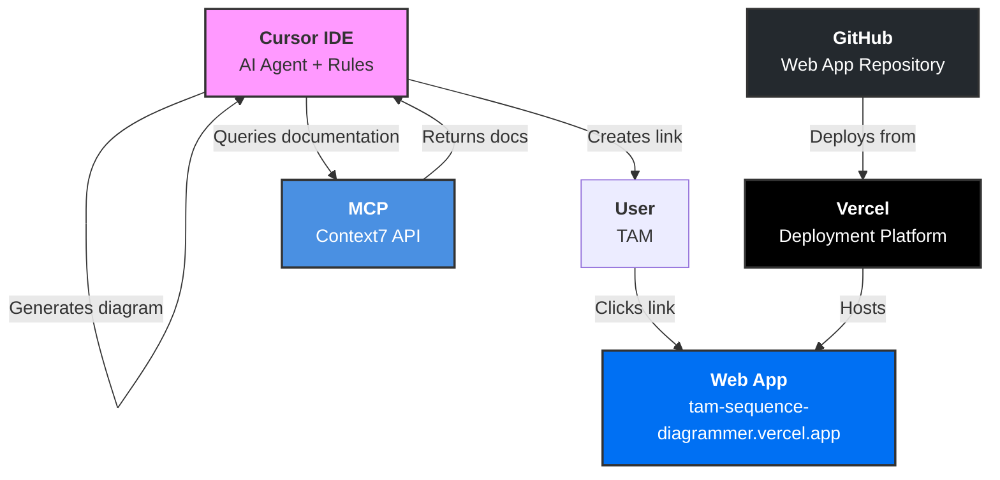

```mermaid
flowchart TD
    Cursor["`**Cursor IDE**<br/>AI Agent + Rules`"]
    GitHub["`**GitHub**<br/>Web App Repository`"]
    Vercel["`**Vercel**<br/>Deployment Platform`"]
    WebApp["`**Web App**<br/>tam-sequence-diagrammer.vercel.app`"]
    User["`**User**<br/>TAM`"]
    MCP["`**MCP**<br/>Context7 API`"]
    
    Cursor -->|"Queries documentation"| MCP
    MCP -->|"Returns docs"| Cursor
    Cursor -->|"Generates diagram"| Cursor
    Cursor -->|"Creates link"| User
    User -->|"Clicks link"| WebApp
    
    GitHub -->|"Deploys from"| Vercel
    Vercel -->|"Hosts"| WebApp
    
    style Cursor fill:#f9f,stroke:#333,stroke-width:2px
    style GitHub fill:#24292e,stroke:#333,stroke-width:2px,color:#fff
    style Vercel fill:#000,stroke:#333,stroke-width:2px,color:#fff
    style WebApp fill:#0070f3,stroke:#333,stroke-width:2px,color:#fff
    style MCP fill:#4a90e2,stroke:#333,stroke-width:2px,color:#fff
```

