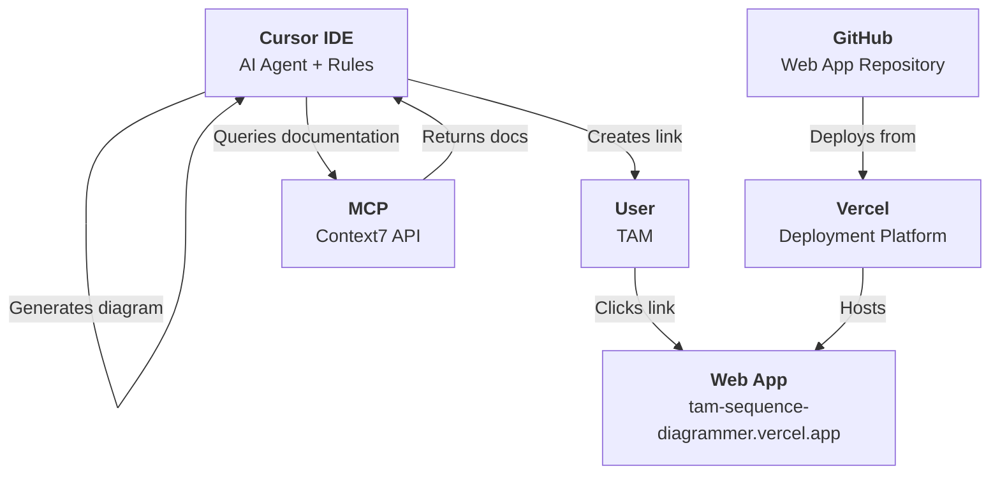

```mermaid
flowchart TD
    Cursor["`**Cursor IDE**<br/>AI Agent + Rules`"]
    GitHub["`**GitHub**<br/>Web App Repository`"]
    Vercel["`**Vercel**<br/>Deployment Platform`"]
    WebApp["`**Web App**<br/>tam-sequence-diagrammer.vercel.app`"]
    User["`**User**<br/>TAM`"]
    MCP["`**MCP**<br/>Context7 API`"]
    
    Cursor -->|"Queries documentation"| MCP
    MCP -->|"Returns docs"| Cursor
    Cursor -->|"Generates diagram"| Cursor
    Cursor -->|"Creates link"| User
    User -->|"Clicks link"| WebApp
    
    GitHub -->|"Deploys from"| Vercel
    Vercel -->|"Hosts"| WebApp
```

