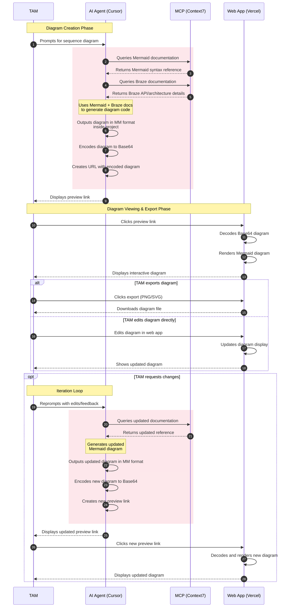

```mermaid
sequenceDiagram
    autonumber
    participant TAM as TAM
    participant AI as AI Agent (Cursor)
    participant MCP as MCP (Context7)
    participant WA as Web App (Vercel)

    Note over TAM,AI: Diagram Creation Phase
    TAM->>AI: Prompts for sequence diagram
    rect rgb(237, 26, 59, 0.1)
    AI->>MCP: Queries Mermaid documentation
    MCP-->>AI: Returns Mermaid syntax reference
    AI->>MCP: Queries Braze documentation
    MCP-->>AI: Returns Braze API/architecture details
    Note over AI: Uses Mermaid + Braze docs<br/>to generate diagram code
    AI->>AI: Outputs diagram in MM format<br/>inside project
    AI->>AI: Encodes diagram to Base64
    AI->>AI: Creates URL with encoded diagram
    end
    AI-->>TAM: Displays preview link

    Note over TAM,WA: Diagram Viewing & Export Phase
    TAM->>WA: Clicks preview link
    WA->>WA: Decodes Base64 diagram
    WA->>WA: Renders Mermaid diagram
    WA-->>TAM: Displays interactive diagram

    alt TAM exports diagram
        TAM->>WA: Clicks export (PNG/SVG)
        WA-->>TAM: Downloads diagram file
    else TAM edits diagram directly
        TAM->>WA: Edits diagram in web app
        WA->>WA: Updates diagram display
        WA-->>TAM: Shows updated diagram
    end

    opt TAM requests changes
        Note over TAM,AI: Iteration Loop
        TAM->>AI: Reprompts with edits/feedback
        rect rgb(237, 26, 59, 0.1)
        AI->>MCP: Queries updated documentation
        MCP-->>AI: Returns updated reference
        Note over AI: Generates updated<br/>Mermaid diagram
        AI->>AI: Outputs updated diagram in MM format
        AI->>AI: Encodes new diagram to Base64
        AI->>AI: Creates new preview link
        end
        AI-->>TAM: Displays updated preview link
        TAM->>WA: Clicks new preview link
        WA->>WA: Decodes and renders new diagram
        WA-->>TAM: Displays updated diagram
    end
```

