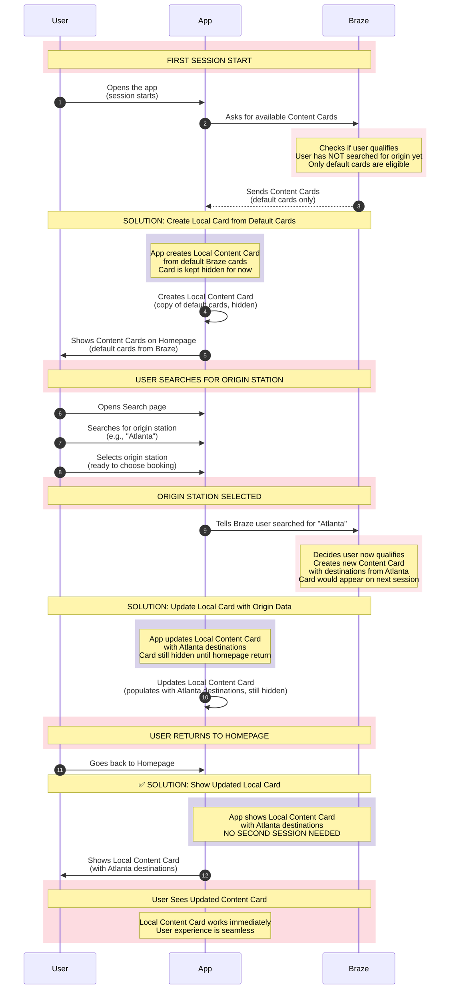

```mermaid
sequenceDiagram
    autonumber
    participant User
    participant App
    participant Braze

    rect rgb(237, 26, 59, 0.15)
    Note over User,Braze: FIRST SESSION START
    end
    User->>App: Opens the app<br/>(session starts)
    App->>Braze: Asks for available Content Cards
    
    rect rgb(237, 26, 59, 0.1)
    Note over Braze: Checks if user qualifies<br/>User has NOT searched for origin yet<br/>Only default cards are eligible
    end
    
    Braze-->>App: Sends Content Cards<br/>(default cards only)
    
    Note over User,Braze: SOLUTION: Create Local Card from Default Cards
    rect rgb(65, 35, 153, 0.2)
    Note over App: App creates Local Content Card<br/>from default Braze cards<br/>Card is kept hidden for now
    end
    App->>App: Creates Local Content Card<br/>(copy of default cards, hidden)
    App->>User: Shows Content Cards on Homepage<br/>(default cards from Braze)

    rect rgb(237, 26, 59, 0.15)
    Note over User,Braze: USER SEARCHES FOR ORIGIN STATION
    end
    User->>App: Opens Search page
    User->>App: Searches for origin station<br/>(e.g., "Atlanta")
    User->>App: Selects origin station<br/>(ready to choose booking)
    
    rect rgb(237, 26, 59, 0.15)
    Note over User,Braze: ORIGIN STATION SELECTED
    end
    App->>Braze: Tells Braze user searched for "Atlanta"
    
    rect rgb(237, 26, 59, 0.1)
    Note over Braze: Decides user now qualifies<br/>Creates new Content Card<br/>with destinations from Atlanta<br/>Card would appear on next session
    end
    
    Note over User,Braze: SOLUTION: Update Local Card with Origin Data
    rect rgb(65, 35, 153, 0.2)
    Note over App: App updates Local Content Card<br/>with Atlanta destinations<br/>Card still hidden until homepage return
    end
    App->>App: Updates Local Content Card<br/>(populates with Atlanta destinations, still hidden)
    
    rect rgb(237, 26, 59, 0.15)
    Note over User,Braze: USER RETURNS TO HOMEPAGE
    end
    User->>App: Goes back to Homepage
    
    Note over User,Braze: ✅ SOLUTION: Show Updated Local Card
    rect rgb(65, 35, 153, 0.2)
    Note over App,Braze: App shows Local Content Card<br/>with Atlanta destinations<br/>NO SECOND SESSION NEEDED
    end
    App->>User: Shows Local Content Card<br/>(with Atlanta destinations)

    rect rgb(237, 26, 59, 0.15)
    Note over User,Braze: User Sees Updated Content Card
    Note over App: Local Content Card works immediately<br/>User experience is seamless
    end
```

