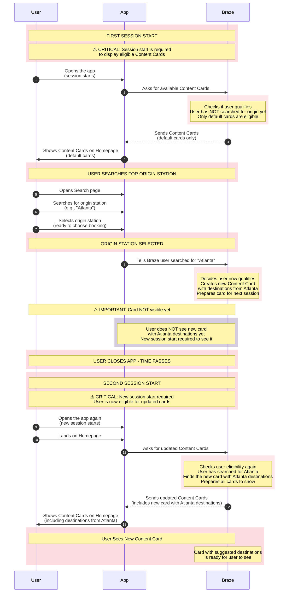

```mermaid
sequenceDiagram
    autonumber
    participant User
    participant App
    participant Braze

    rect rgb(237, 26, 59, 0.15)
    Note over User,Braze: FIRST SESSION START
    Note over User,Braze: ⚠️ CRITICAL: Session start is required<br/>to display eligible Content Cards
    end
    User->>App: Opens the app<br/>(session starts)
    App->>Braze: Asks for available Content Cards
    
    rect rgb(237, 26, 59, 0.1)
    Note over Braze: Checks if user qualifies<br/>User has NOT searched for origin yet<br/>Only default cards are eligible
    end
    
    Braze-->>App: Sends Content Cards<br/>(default cards only)
    App->>User: Shows Content Cards on Homepage<br/>(default cards)

    rect rgb(237, 26, 59, 0.15)
    Note over User,Braze: USER SEARCHES FOR ORIGIN STATION
    end
    User->>App: Opens Search page
    User->>App: Searches for origin station<br/>(e.g., "Atlanta")
    User->>App: Selects origin station<br/>(ready to choose booking)
    
    rect rgb(237, 26, 59, 0.15)
    Note over User,Braze: ORIGIN STATION SELECTED
    end
    App->>Braze: Tells Braze user searched for "Atlanta"
    
    rect rgb(237, 26, 59, 0.1)
    Note over Braze: Decides user now qualifies<br/>Creates new Content Card<br/>with destinations from Atlanta<br/>Prepares card for next session
    end
    
    Note over User,Braze: ⚠️ IMPORTANT: Card NOT visible yet
    rect rgb(48, 2, 102, 0.2)
    Note over App,Braze: User does NOT see new card<br/>with Atlanta destinations yet<br/>New session start required to see it
    end

    rect rgb(237, 26, 59, 0.15)
    Note over User,Braze: USER CLOSES APP - TIME PASSES
    end

    rect rgb(237, 26, 59, 0.15)
    Note over User,Braze: SECOND SESSION START
    Note over User,Braze: ⚠️ CRITICAL: New session start required<br/>User is now eligible for updated cards
    end
    User->>App: Opens the app again<br/>(new session starts)
    User->>App: Lands on Homepage
    App->>Braze: Asks for updated Content Cards
    
    rect rgb(237, 26, 59, 0.1)
    Note over Braze: Checks user eligibility again<br/>User has searched for Atlanta<br/>Finds the new card with Atlanta destinations<br/>Prepares all cards to show
    end
    
    Braze-->>App: Sends updated Content Cards<br/>(includes new card with Atlanta destinations)
    App->>User: Shows Content Cards on Homepage<br/>(including destinations from Atlanta)

    rect rgb(237, 26, 59, 0.15)
    Note over User,Braze: User Sees New Content Card
    Note over Braze: Card with suggested destinations<br/>is ready for user to see
    end
```

