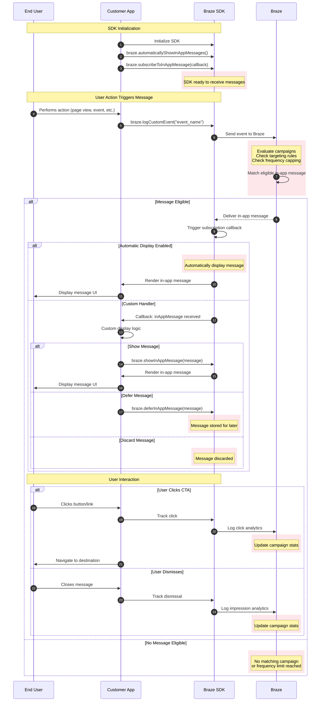

```mermaid
sequenceDiagram
    autonumber
    participant EU as End User
    participant WA as Customer App
    participant BS as Braze SDK
    participant B as Braze

    Note over EU,BS: SDK Initialization
    WA->>BS: Initialize SDK
    WA->>BS: braze.automaticallyShowInAppMessages()
    WA->>BS: braze.subscribeToInAppMessage(callback)
    rect rgb(237, 26, 59, 0.1)
    Note over BS: SDK ready to receive messages
    end

    Note over EU,BS: User Action Triggers Message
    EU->>WA: Performs action (page view, event, etc.)
    WA->>BS: braze.logCustomEvent("event_name")
    BS->>B: Send event to Braze
    
    rect rgb(237, 26, 59, 0.1)
    Note over B: Evaluate campaigns<br/>Check targeting rules<br/>Check frequency capping
    B->>B: Match eligible in-app message
    end
    
    alt Message Eligible
        B-->>BS: Deliver in-app message
        BS->>BS: Trigger subscription callback
        
        alt Automatic Display Enabled
            rect rgb(237, 26, 59, 0.1)
            Note over BS: Automatically display message
            end
            BS->>WA: Render in-app message
            WA->>EU: Display message UI
        else Custom Handler
            BS->>WA: Callback: inAppMessage received
            WA->>WA: Custom display logic
            
            alt Show Message
                WA->>BS: braze.showInAppMessage(message)
                BS->>WA: Render in-app message
                WA->>EU: Display message UI
            else Defer Message
                WA->>BS: braze.deferInAppMessage(message)
                rect rgb(237, 26, 59, 0.1)
                Note over BS: Message stored for later
                end
            else Discard Message
                rect rgb(237, 26, 59, 0.1)
                Note over BS: Message discarded
                end
            end
        end
        
        Note over EU,BS: User Interaction
        alt User Clicks CTA
            EU->>WA: Clicks button/link
            WA->>BS: Track click
            BS->>B: Log click analytics
            rect rgb(237, 26, 59, 0.1)
            Note over B: Update campaign stats
            end
            WA->>EU: Navigate to destination
        else User Dismisses
            EU->>WA: Closes message
            WA->>BS: Track dismissal
            BS->>B: Log impression analytics
            rect rgb(237, 26, 59, 0.1)
            Note over B: Update campaign stats
            end
        end
    else No Message Eligible
        rect rgb(237, 26, 59, 0.1)
        Note over B: No matching campaign<br/>or frequency limit reached
        end
    end
```

