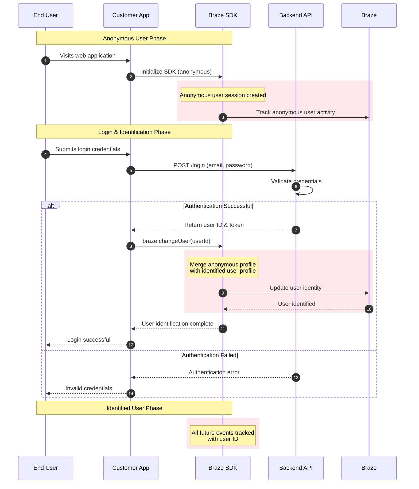

```mermaid
sequenceDiagram
    autonumber
    participant EU as End User
    participant WA as Customer App
    participant BS as Braze SDK
    participant BE as Backend API
    participant B as Braze

    Note over EU,BS: Anonymous User Phase
    EU->>WA: Visits web application
    WA->>BS: Initialize SDK (anonymous)
    rect rgb(237, 26, 59, 0.1)
    Note over BS: Anonymous user session created
    BS->>B: Track anonymous user activity
    end

    Note over EU,BS: Login & Identification Phase
    EU->>WA: Submits login credentials
    WA->>BE: POST /login (email, password)
    BE->>BE: Validate credentials
    
    alt Authentication Successful
        BE-->>WA: Return user ID & token
        WA->>BS: braze.changeUser(userId)
        rect rgb(237, 26, 59, 0.1)
        Note over BS: Merge anonymous profile<br/>with identified user profile
        BS->>B: Update user identity
        B-->>BS: User identified
        end
        BS-->>WA: User identification complete
        WA-->>EU: Login successful
    else Authentication Failed
        BE-->>WA: Authentication error
        WA-->>EU: Invalid credentials
    end

    Note over EU,BS: Identified User Phase
    rect rgb(237, 26, 59, 0.1)
    Note over BS: All future events tracked<br/>with user ID
    end
```

