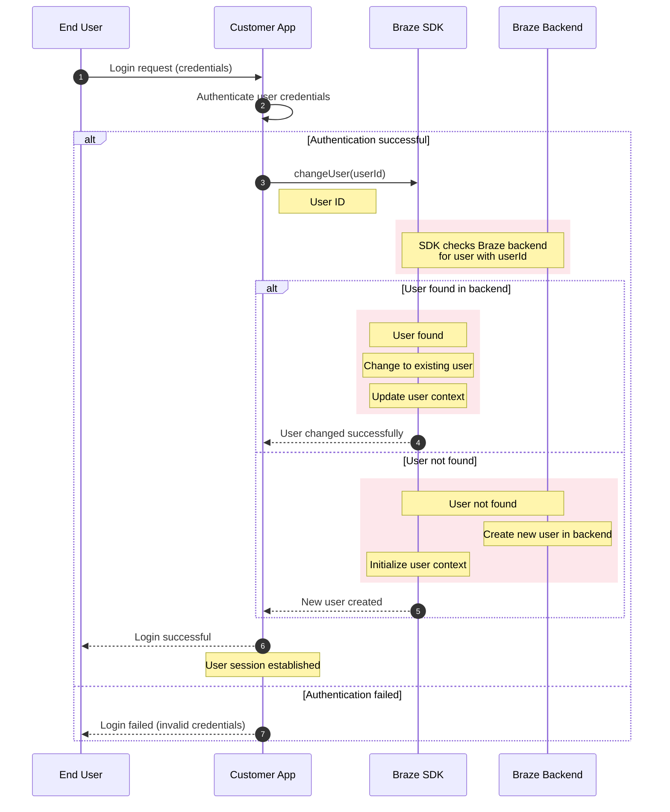

[🚀 Open in Mermaid Live Editor for Preview & Export](https://mermaid.live/edit#base64:eyJjb2RlIjogInNlcXVlbmNlRGlhZ3JhbVxuICAgIGF1dG9udW1iZXJcbiAgICBwYXJ0aWNpcGFudCBVIGFzIEVuZCBVc2VyXG4gICAgcGFydGljaXBhbnQgQSBhcyBDdXN0b21lciBBcHBcbiAgICBwYXJ0aWNpcGFudCBTIGFzIEJyYXplIFNES1xuICAgIHBhcnRpY2lwYW50IEIgYXMgQnJhemUgQmFja2VuZFxuICAgIFxuICAgIFUtPj5BOiBMb2dpbiByZXF1ZXN0IChjcmVkZW50aWFscylcbiAgICBBLT4+QTogQXV0aGVudGljYXRlIHVzZXIgY3JlZGVudGlhbHNcbiAgICBcbiAgICBhbHQgQXV0aGVudGljYXRpb24gc3VjY2Vzc2Z1bFxuICAgICAgICBBLT4+UzogY2hhbmdlVXNlcih1c2VySWQpXG4gICAgICAgIE5vdGUgcmlnaHQgb2YgQTogVXNlciBJRFxuICAgICAgICBcbiAgICAgICAgcmVjdCByZ2IoMjM3LCAyNiwgNTksIDAuMSlcbiAgICAgICAgTm90ZSBvdmVyIFMsQjogU0RLIGNoZWNrcyBCcmF6ZSBiYWNrZW5kPGJyLz5mb3IgdXNlciB3aXRoIHVzZXJJZFxuICAgICAgICBlbmRcbiAgICAgICAgXG4gICAgICAgIGFsdCBVc2VyIGZvdW5kIGluIGJhY2tlbmRcbiAgICAgICAgICAgIHJlY3QgcmdiKDIzNywgMjYsIDU5LCAwLjEpXG4gICAgICAgICAgICBOb3RlIG92ZXIgUzogVXNlciBmb3VuZFxuICAgICAgICAgICAgTm90ZSBvdmVyIFM6IENoYW5nZSB0byBleGlzdGluZyB1c2VyXG4gICAgICAgICAgICBOb3RlIG92ZXIgUzogVXBkYXRlIHVzZXIgY29udGV4dFxuICAgICAgICAgICAgZW5kXG4gICAgICAgICAgICBTLS0+PkE6IFVzZXIgY2hhbmdlZCBzdWNjZXNzZnVsbHlcbiAgICAgICAgZWxzZSBVc2VyIG5vdCBmb3VuZFxuICAgICAgICAgICAgcmVjdCByZ2IoMjM3LCAyNiwgNTksIDAuMSlcbiAgICAgICAgICAgIE5vdGUgb3ZlciBTLEI6IFVzZXIgbm90IGZvdW5kXG4gICAgICAgICAgICBOb3RlIG92ZXIgQjogQ3JlYXRlIG5ldyB1c2VyIGluIGJhY2tlbmRcbiAgICAgICAgICAgIE5vdGUgb3ZlciBTOiBJbml0aWFsaXplIHVzZXIgY29udGV4dFxuICAgICAgICAgICAgZW5kXG4gICAgICAgICAgICBTLS0+PkE6IE5ldyB1c2VyIGNyZWF0ZWRcbiAgICAgICAgZW5kXG4gICAgICAgIFxuICAgICAgICBBLS0+PlU6IExvZ2luIHN1Y2Nlc3NmdWxcbiAgICAgICAgTm90ZSBvdmVyIEE6IFVzZXIgc2Vzc2lvbiBlc3RhYmxpc2hlZFxuICAgIGVsc2UgQXV0aGVudGljYXRpb24gZmFpbGVkXG4gICAgICAgIEEtLT4+VTogTG9naW4gZmFpbGVkIChpbnZhbGlkIGNyZWRlbnRpYWxzKVxuICAgIGVuZCIsICJtZXJtYWlkIjogeyJ0aGVtZSI6ICJkZWZhdWx0In19)

