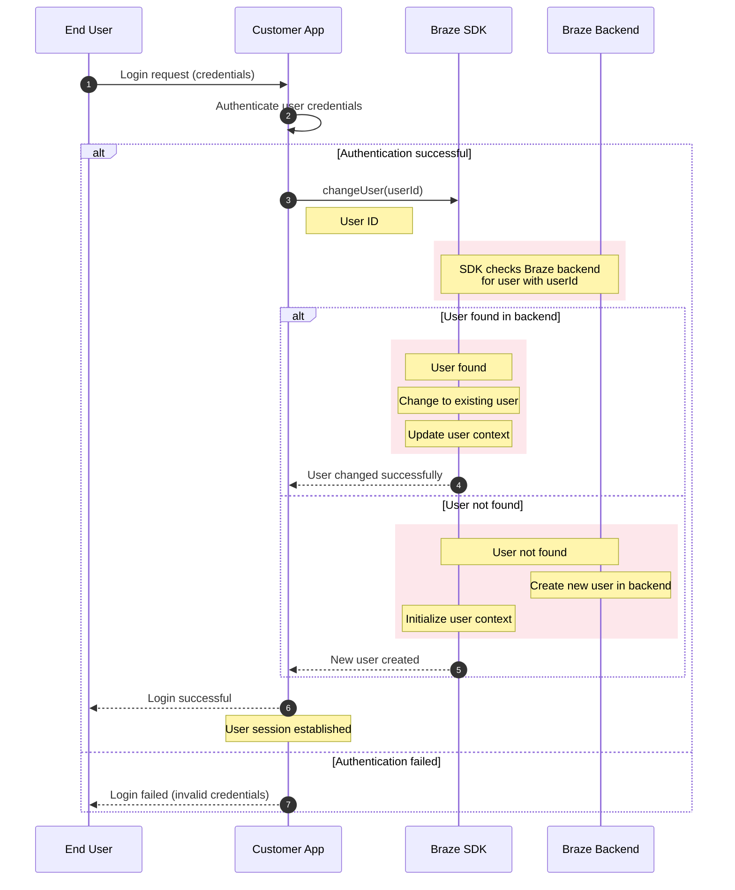

```mermaid
sequenceDiagram
    autonumber
    participant U as End User
    participant A as Customer App
    participant S as Braze SDK
    participant B as Braze Backend
    
    U->>A: Login request (credentials)
    A->>A: Authenticate user credentials
    
    alt Authentication successful
        A->>S: changeUser(userId)
        Note right of A: User ID
        
        rect rgb(237, 26, 59, 0.1)
        Note over S,B: SDK checks Braze backend<br/>for user with userId
        end
        
        alt User found in backend
            rect rgb(237, 26, 59, 0.1)
            Note over S: User found
            Note over S: Change to existing user
            Note over S: Update user context
            end
            S-->>A: User changed successfully
        else User not found
            rect rgb(237, 26, 59, 0.1)
            Note over S,B: User not found
            Note over B: Create new user in backend
            Note over S: Initialize user context
            end
            S-->>A: New user created
        end
        
        A-->>U: Login successful
        Note over A: User session established
    else Authentication failed
        A-->>U: Login failed (invalid credentials)
    end
```
