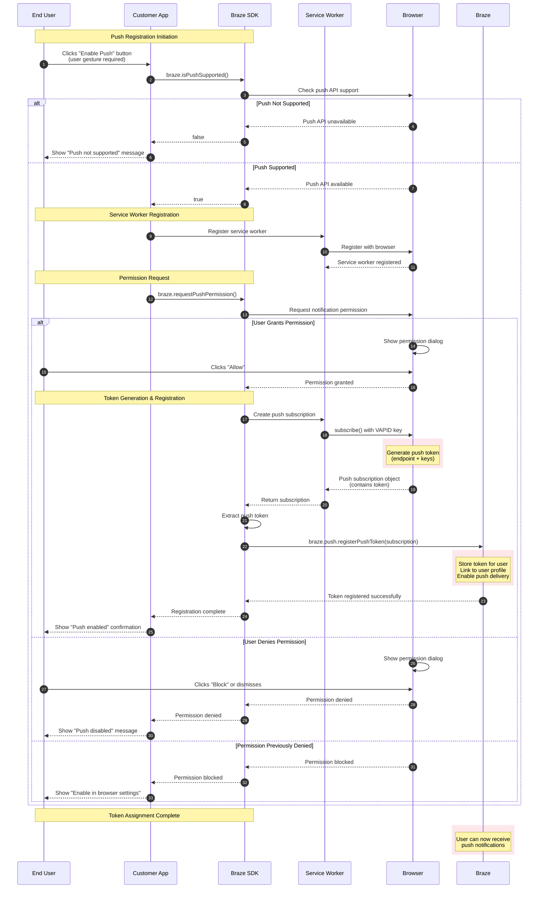

```mermaid
sequenceDiagram
    autonumber
    participant EU as End User
    participant WA as Customer App
    participant BS as Braze SDK
    participant SW as Service Worker
    participant BR as Browser
    participant B as Braze

    Note over EU,BS: Push Registration Initiation
    EU->>WA: Clicks "Enable Push" button<br/>(user gesture required)
    WA->>BS: braze.isPushSupported()
    BS->>BR: Check push API support
    
    alt Push Not Supported
        BR-->>BS: Push API unavailable
        BS-->>WA: false
        WA-->>EU: Show "Push not supported" message
    else Push Supported
        BR-->>BS: Push API available
        BS-->>WA: true
        
        Note over EU,BS: Service Worker Registration
        WA->>SW: Register service worker
        SW->>BR: Register with browser
        BR-->>SW: Service worker registered
        
        Note over EU,BS: Permission Request
        WA->>BS: braze.requestPushPermission()
        BS->>BR: Request notification permission
        
        alt User Grants Permission
            BR->>BR: Show permission dialog
            EU->>BR: Clicks "Allow"
            BR-->>BS: Permission granted
            
            Note over EU,BS: Token Generation & Registration
            BS->>SW: Create push subscription
            SW->>BR: subscribe() with VAPID key
            rect rgb(237, 26, 59, 0.1)
            Note over BR: Generate push token<br/>(endpoint + keys)
            end
            BR-->>SW: Push subscription object<br/>(contains token)
            SW-->>BS: Return subscription
            
            BS->>BS: Extract push token
            BS->>B: braze.push.registerPushToken(subscription)
            rect rgb(237, 26, 59, 0.1)
            Note over B: Store token for user<br/>Link to user profile<br/>Enable push delivery
            end
            B-->>BS: Token registered successfully
            BS-->>WA: Registration complete
            WA-->>EU: Show "Push enabled" confirmation
        else User Denies Permission
            BR->>BR: Show permission dialog
            EU->>BR: Clicks "Block" or dismisses
            BR-->>BS: Permission denied
            BS-->>WA: Permission denied
            WA-->>EU: Show "Push disabled" message
        else Permission Previously Denied
            BR-->>BS: Permission blocked
            BS-->>WA: Permission blocked
            WA-->>EU: Show "Enable in browser settings"
        end
    end

    Note over EU,BS: Token Assignment Complete
    rect rgb(237, 26, 59, 0.1)
    Note over B: User can now receive<br/>push notifications
    end
```

