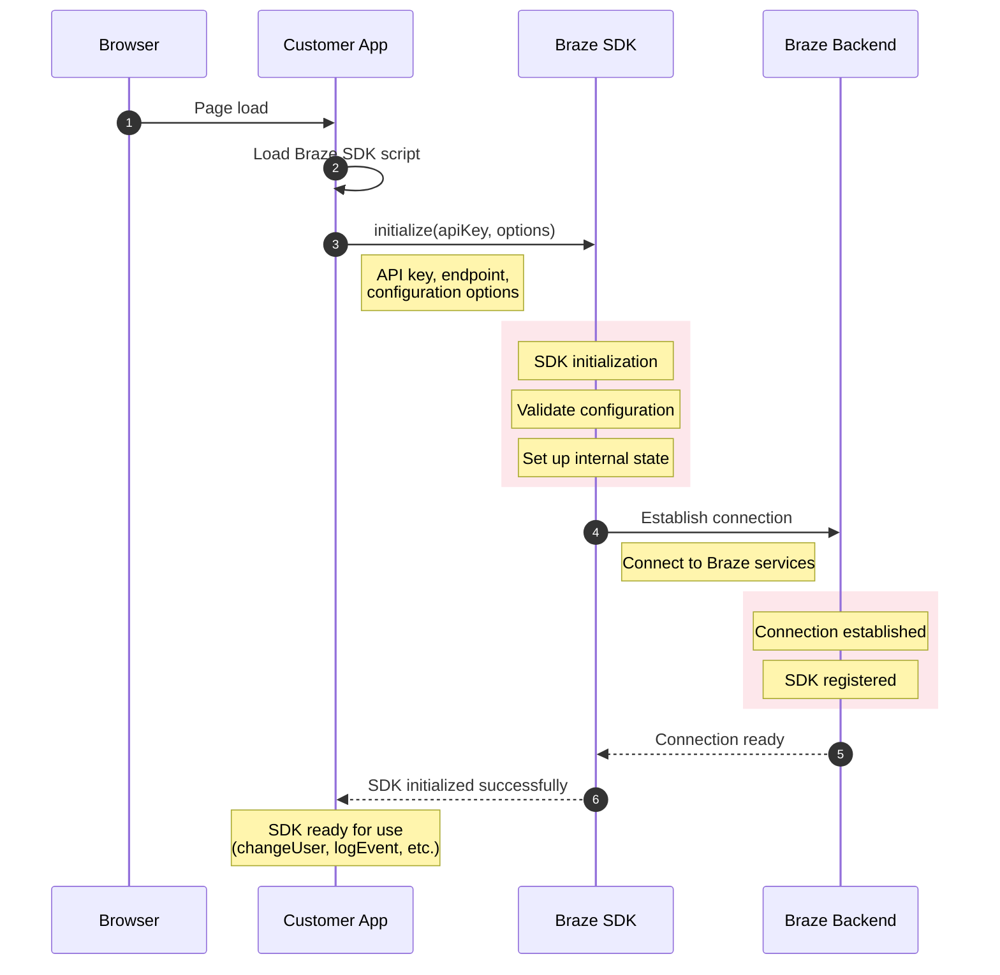

[🚀 Open in Mermaid Live Editor for Preview & Export](https://mermaid.live/edit#base64:eyJjb2RlIjogInNlcXVlbmNlRGlhZ3JhbVxuICAgIGF1dG9udW1iZXJcbiAgICBwYXJ0aWNpcGFudCBCIGFzIEJyb3dzZXJcbiAgICBwYXJ0aWNpcGFudCBBIGFzIEN1c3RvbWVyIEFwcFxuICAgIHBhcnRpY2lwYW50IFMgYXMgQnJhemUgU0RLXG4gICAgcGFydGljaXBhbnQgQkIgYXMgQnJhemUgQmFja2VuZFxuICAgIFxuICAgIEItPj5BOiBQYWdlIGxvYWRcbiAgICBBLT4+QTogTG9hZCBCcmF6ZSBTREsgc2NyaXB0XG4gICAgXG4gICAgQS0+PlM6IGluaXRpYWxpemUoYXBpS2V5LCBvcHRpb25zKVxuICAgIE5vdGUgcmlnaHQgb2YgQTogQVBJIGtleSwgZW5kcG9pbnQsPGJyLz5jb25maWd1cmF0aW9uIG9wdGlvbnNcbiAgICBcbiAgICByZWN0IHJnYigyMzcsIDI2LCA1OSwgMC4xKVxuICAgIE5vdGUgb3ZlciBTOiBTREsgaW5pdGlhbGl6YXRpb25cbiAgICBOb3RlIG92ZXIgUzogVmFsaWRhdGUgY29uZmlndXJhdGlvblxuICAgIE5vdGUgb3ZlciBTOiBTZXQgdXAgaW50ZXJuYWwgc3RhdGVcbiAgICBlbmRcbiAgICBcbiAgICBTLT4+QkI6IEVzdGFibGlzaCBjb25uZWN0aW9uXG4gICAgTm90ZSByaWdodCBvZiBTOiBDb25uZWN0IHRvIEJyYXplIHNlcnZpY2VzXG4gICAgXG4gICAgcmVjdCByZ2IoMjM3LCAyNiwgNTksIDAuMSlcbiAgICBOb3RlIG92ZXIgQkI6IENvbm5lY3Rpb24gZXN0YWJsaXNoZWRcbiAgICBOb3RlIG92ZXIgQkI6IFNESyByZWdpc3RlcmVkXG4gICAgZW5kXG4gICAgXG4gICAgQkItLT4+UzogQ29ubmVjdGlvbiByZWFkeVxuICAgIFMtLT4+QTogU0RLIGluaXRpYWxpemVkIHN1Y2Nlc3NmdWxseVxuICAgIFxuICAgIE5vdGUgb3ZlciBBOiBTREsgcmVhZHkgZm9yIHVzZTxici8+KGNoYW5nZVVzZXIsIGxvZ0V2ZW50LCBldGMuKSIsICJtZXJtYWlkIjogeyJ0aGVtZSI6ICJkZWZhdWx0In19)

