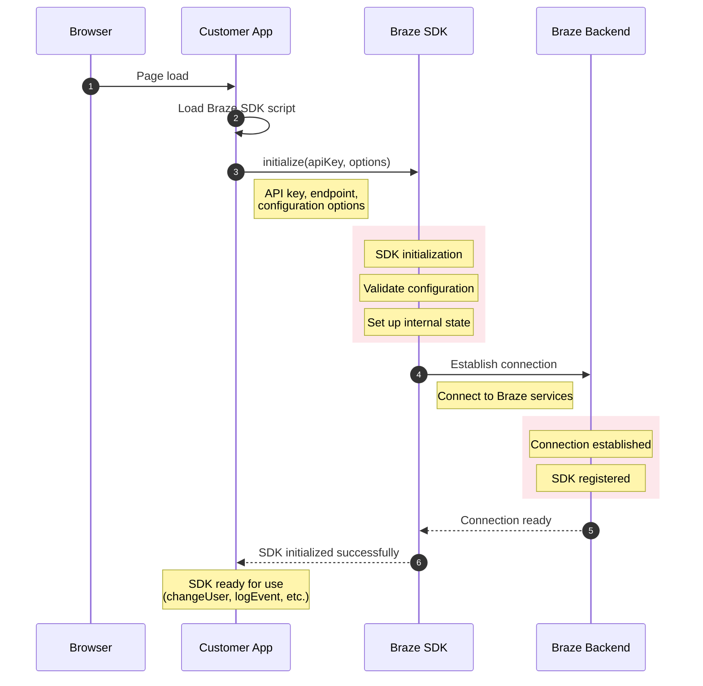

```mermaid
sequenceDiagram
    autonumber
    participant B as Browser
    participant A as Customer App
    participant S as Braze SDK
    participant BB as Braze Backend
    
    B->>A: Page load
    A->>A: Load Braze SDK script
    
    A->>S: initialize(apiKey, options)
    Note right of A: API key, endpoint,<br/>configuration options
    
    rect rgb(237, 26, 59, 0.1)
    Note over S: SDK initialization
    Note over S: Validate configuration
    Note over S: Set up internal state
    end
    
    S->>BB: Establish connection
    Note right of S: Connect to Braze services
    
    rect rgb(237, 26, 59, 0.1)
    Note over BB: Connection established
    Note over BB: SDK registered
    end
    
    BB-->>S: Connection ready
    S-->>A: SDK initialized successfully
    
    Note over A: SDK ready for use<br/>(changeUser, logEvent, etc.)
```
